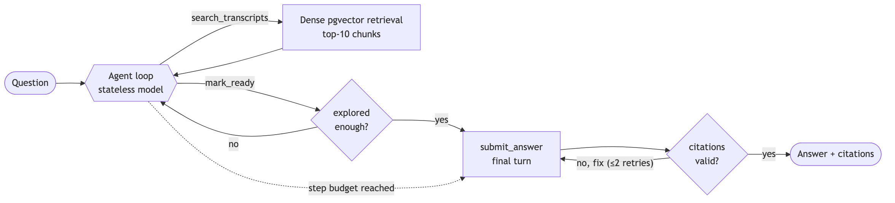
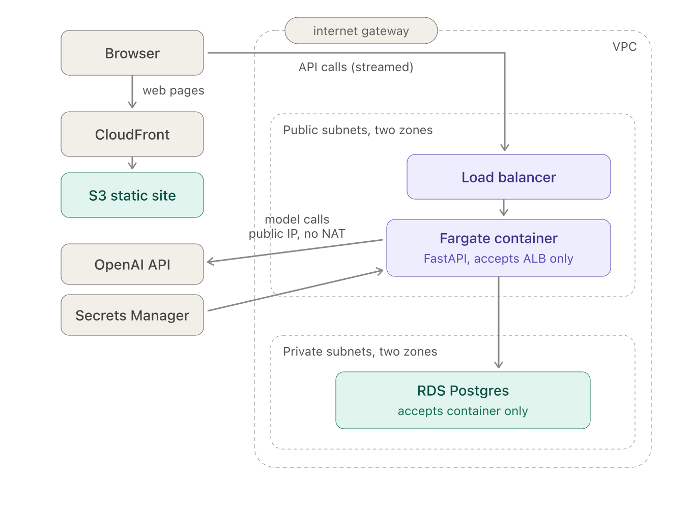
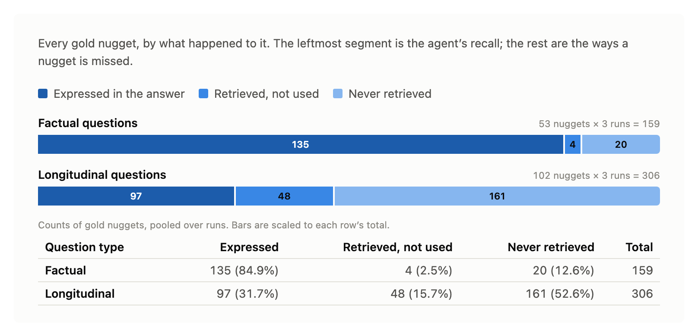

# bounded-deep-research

AnswerTrail is a deep-research agent over a bounded corpus: the transcripts of a single YouTube creator.
Given a question, it runs a roll-your-own ReAct loop, searching the transcripts, reasoning about what it finds, and writing an answer whose every citation is checked against the corpus before the answer is accepted.
Retrieval is dense-only over Postgres with pgvector, the model is stateless, and the agent drives its own exploration until it decides it is ready to answer.
It is live in production on AWS at `answertrail.yeesengchan.com`, though the live site may be taken down from time to time to avoid running costs. The [demo](#demo) below shows a full run and does not depend on the site being up.

The project is also its own measuring instrument.
A nugget-based evaluation scores a frozen agent on two kinds of question, factual and longitudinal, with a calibrated cross-family judge (Cohen's kappa 0.88).

This README walks the system in the order it is built: the corpus and how it is ingested, the ReAct agent that answers over it, how that agent is deployed on AWS, and the evaluation, both how its gold data is built and what the agent scores against it.

## Demo

[](https://youtu.be/yY83UsH2xXY)

One question, answered end to end. The agent searches, decides for itself when it has enough evidence, and writes an answer in which every citation has been checked against the passages actually retrieved. Clicking a citation opens the source video at the exact moment it came from.

## The corpus and its ingestion

The system starts from the corpus, because every answer is grounded in it.
The corpus for the live demo is one AI/LLM creator's channel: 475 videos from the most recent 16 months, cut into 25,401 transcript chunks (about 52 per video).
Postgres is the source of truth for the corpus; the embeddings and the local search index are derived from it.

The corpus is built offline by a pipeline that runs once per channel, each stage as `uv run python -m ingest.<name>`:

- **List the videos** ([`list_channel_videos`](https://github.com/chanys/bounded-deep-research/blob/main/ingest/list_channel_videos.py)). Enumerate the channel's uploads through the YouTube Data API, drop anything 180 seconds or shorter so Shorts are excluded, and write a manifest of the survivors with their titles, descriptions, and publish dates.
- **Fetch the transcripts** ([`fetch_transcripts`](https://github.com/chanys/bounded-deep-research/blob/main/ingest/fetch_transcripts.py)). Pull each video's caption track, retrying transient network drops with backoff so one dropped connection does not kill a long batch. Each video's language, and whether its captions are auto-generated or human-written, is recorded.
- **Clean the ASR** ([`clean_transcripts`](https://github.com/chanys/bounded-deep-research/blob/main/ingest/clean_transcripts.py)). Auto-generated captions carry recognition errors, so a `gpt-5.4-mini` pass repairs them in small batches, each batch given its neighbors as read-only context. A length guard keeps the raw text whenever the rewrite drifts too far from the original, and channels with human captions skip this stage.
- **Chunk into 30-second windows** ([`chunk_transcripts`](https://github.com/chanys/bounded-deep-research/blob/main/ingest/chunk_transcripts.py)). Group the caption lines into fixed 30-second windows, the atomic unit the agent later searches and cites. Each chunk's id is `video_id:start_second`.
- **Embed** ([`embed_chunks`](https://github.com/chanys/bounded-deep-research/blob/main/ingest/embed_chunks.py)). Embed every chunk with OpenAI's `text-embedding-3-large` at 1536 dimensions, the same model and dimension the agent uses at query time, and store the vector back in Postgres.

Each of the last three stages reads from Postgres the rows not yet at its stage, so the pipeline is resumable: a crash resumes where it stopped rather than restarting.
A final stage builds a local OpenSearch index ([`index_chunks`](https://github.com/chanys/bounded-deep-research/blob/main/ingest/index_chunks.py)), used only by the offline evaluation for the BM25 and hybrid ablation; production never uses it.

## The ReAct agent

With the corpus in place, the agent is what turns a question into an answer over it.
It runs a ReAct loop over the transcripts: it searches, reasons about what it finds, and writes an answer with citations.
The model is stateless, so the loop holds the whole conversation and drives the run.
The agent acts only through tools, which lets the loop stop it and force it to finish, and the citations in its answer are validated against the corpus before the answer is accepted.



### Request path and streaming

A query arrives at the `POST /query` endpoint, and the app runs the agent while showing its work.
As the agent searches, those actions appear live in the browser, and when it finishes, the final answer streams back token by token.
Both use Server-Sent Events.
Before the agent runs, three cheap checks gate the request: the channel must exist, the day's spend cap must not be reached, and the caller must be within their per-IP quota.

### The agent loop

The loop, in [`app/agent.py`](https://github.com/chanys/bounded-deep-research/blob/main/app/agent.py), drives the run.
Because the model is stateless, the loop keeps the whole conversation and hands all of it back on every turn.

Each turn, the model does one of two things:

- **Search** the corpus, with one or more queries at once, and read the results on the next turn.
- **Signal that it is ready** to answer.

The loop repeats until the model signals ready or a step budget of 15 turns is reached, and then a single final turn writes the answer.

Two guardrails keep it honest:

- Before it may answer, the model must have run at least a couple of distinct searches, so it cannot answer without exploring.
- A run that keeps searching but finds nothing still terminates, reporting that the corpus cannot answer rather than looping forever.

### The tools

The agent has three tools, in [`app/tools.py`](https://github.com/chanys/bounded-deep-research/blob/main/app/tools.py):

- **`search_transcripts`** embeds the agent's query and runs a dense nearest-neighbour search over the pre-embedded chunks, using the Postgres HNSW index. It returns the top 10 by cosine similarity, a count set by the `retrieval_k` configuration. There is no re-ranking or pruning: the top matches come back as-is, each with its full transcript text.
- **`mark_ready`** takes no arguments; the model calls it to signal it has gathered enough. It ends the search phase, and once the exploration guardrail (above) passes, the loop runs the final answer turn.
- **`submit_answer`** delivers the final answer, and its reliability comes from validating the citations. The citations are ids only (`video_id`, `start_ts`, `end_ts`), and the loop checks every one against the index before accepting the answer, so a fabricated citation is rejected and sent back to be corrected. Making it a tool means producing the answer runs through the same loop as searching: a rejected citation returns on the normal tool-result channel for the model to fix, a submitted answer is the loop's stop signal, and `tool_choice` can force that call when the step budget runs out.

### Retrieval

Retrieval is dense-only over Postgres with pgvector, in [`app/retrieval.py`](https://github.com/chanys/bounded-deep-research/blob/main/app/retrieval.py).
A search embeds the query and returns the ten nearest transcript chunks by cosine similarity.

The embeddings use OpenAI's `text-embedding-3-large`, for both the corpus and the query so the two share one vector space:

- It is natively 3072-dimensional, but the stored and queried vectors are 1536-dimensional, because pgvector's HNSW index caps vectors at 2000.
- The 1536-dim vectors are Matryoshka embeddings: the model is trained (Matryoshka Representation Learning) so that a leading prefix of the full vector is itself a complete embedding, with the earliest dimensions carrying the most information.
- So we ask the API for 1536 dimensions, which returns the first 1536 of the 3072 and renormalizes them, keeping most of the quality while fitting under the index cap.

A local-only OpenSearch backend also supports BM25 and hybrid retrieval. We used it for one offline ablation, swapping the dense path for hybrid retrieval (dense plus BM25, fused with Reciprocal Rank Fusion); it came out no better than dense-only.

### The research recipe

The agent's exploration policy lives in the prompt, [`prompts/research_recipe.md`](https://github.com/chanys/bounded-deep-research/blob/main/prompts/research_recipe.md), not in the code, and it is versioned (currently 0.8.0).
It guides how the model searches and reformulates its queries, and its most important rule is to halt and report that the corpus cannot answer, rather than fabricate an answer, when the evidence is not there.

### Two reasoning efforts

Both turns run on the agent model, `gpt-5.4`, but at different reasoning efforts.
The exploration turns run with no reasoning effort; only the final answer turn uses a low reasoning effort.
The two are separate settings, so the answer turn's effort can be raised later without changing exploration.

### Evidence and provenance

Every run is recorded as a `RunEvidenceState`, built in [`app/evidence.py`](https://github.com/chanys/bounded-deep-research/blob/main/app/evidence.py), so it can be inspected afterward, both for the demo's Run Audit panel and for the evaluation.
The record holds the searches and their queries, the chunks retrieved and cited, the token usage and cost, and the run's outcome.
It is also stamped with the recipe version and the code's git SHA, so any result can be tied back to the exact agent that produced it, which is what let the evaluation freeze one agent and compare ablations against it.

## Deployment on AWS

That agent runs as a service on AWS, defined entirely in Terraform under `infra/terraform/`, one main stack plus a small bootstrap, all in `us-east-1`.
Using Terraform, the stack is designed to be easily torn down and rebuilt.
No secret is kept in code or git; the one exception is the database password, which Terraform generates and keeps in encrypted state.

### Architecture overview



The frontend is a static export served from S3 through CloudFront, so it is cached at the edge, which reduces reading latency.
The API is a container behind a load balancer.
The API runs the agent and streams progress back over Server-Sent Events.
The browser calls the API on its own subdomain (`api.<domain>`), and the two are wired together by the DNS records in the edge layer.

### The network

The load balancer, the app, and the database all run inside one VPC, defined in [`network.tf`](https://github.com/chanys/bounded-deep-research/blob/main/infra/terraform/network.tf).
It is `10.0.0.0/16` and spans two Availability Zones, because RDS requires subnets in at least two:

- The database is held in the private subnets.
- The load balancer is attached to the public subnets.
- The app container (accepting traffic only via the ALB) is held in the public subnets with a public IP, which allows it to reach OpenAI directly through the Internet Gateway. An alternative would be to hold the app container in the private subnets. However, this would require a \$32-per-month NAT gateway to allow outbound OpenAI API calls from within the private subnets.

### Network security: three tiers

Within that VPC, access is layered so each tier accepts traffic only from the tier in front of it, defined in [`security.tf`](https://github.com/chanys/bounded-deep-research/blob/main/infra/terraform/security.tf):

```
internet --443--> ALB --8000--> app task --5432--> database
```

Each of the three security groups allows inbound from the previous group's security group, not from an IP range, so the rules say "only the app may reach the database" without hardcoding any addresses.
The only thing open to the whole internet is the load balancer on ports 443 and 80.
The app task accepts traffic on port 8000 only from the load balancer's security group, so even though the task sits in a public subnet, nothing on the internet can reach it directly.
The database accepts Postgres on 5432 only from the app task's security group, so it is never reachable from the internet or from anything else in the VPC.

### Compute: ECS/Fargate behind a load balancer

The middle tier of that chain, the app, runs on ECS Fargate, defined in [`compute.tf`](https://github.com/chanys/bounded-deep-research/blob/main/infra/terraform/compute.tf).
The image is stored in a private ECR repository, scanned on push.
The task is small and cheap: ARM64 (Graviton), 0.5 vCPU, 1 GB of memory, and one running copy.

The task definition splits its settings into two kinds:

- Plain settings are passed as environment variables, including `RETRIEVAL_BACKEND=pgvector`, the spend caps, and how to reach the database (host, name, user).
- Sensitive settings are injected from Secrets Manager at start time: the OpenAI key, the database password, and the two access codes.

The load balancer is the public entry point for the API.
Its idle timeout is set to 150 seconds, which is what holds a streaming connection open through the quiet synthesis turn, so the app's 15-second SSE heartbeat has time to keep it alive.
The target group health-checks `/health` every 15 seconds and marks a task healthy after two passes, so a fresh deploy comes into service quickly.

### The database

The last tier of the chain is the database, RDS PostgreSQL 16, defined in [`data.tf`](https://github.com/chanys/bounded-deep-research/blob/main/infra/terraform/data.tf), on a `db.t4g.small` (2 vCPU burstable, 2 GB, Graviton).
The instance lives in the private subnets, behind the database security group, and is not publicly accessible.

The database is disposable, because its data can always be reloaded from a dump kept in S3.
Terraform generates the master password itself (a 30-character alphanumeric string, so it never contains characters that break a connection URL) and stores it in the encrypted state file, then injects it into the container as `DB_PASSWORD`.

### Secrets

The secret values that the task and the database rely on live in Secrets Manager, defined in [`secrets.tf`](https://github.com/chanys/bounded-deep-research/blob/main/infra/terraform/secrets.tf).
Terraform creates the secret containers but not their values, so the OpenAI key, the Langfuse keys, and the two access codes are set out-of-band and never appear in code, state, or git.
The database password is the exception: Terraform generates it, so Terraform also sets its value.

### The edge: frontend and DNS

Everything above is the API side.
In front of it, the edge layer, in [`edge.tf`](https://github.com/chanys/bounded-deep-research/blob/main/infra/terraform/edge.tf), serves the static frontend and terminates HTTPS.
The frontend is a private S3 bucket served through CloudFront, which reads it through an Origin Access Control so the bucket is never public.
Two Route 53 records point the apex domain at CloudFront and `api.<domain>` at the load balancer.

### CI/CD

New versions reach this stack through CI/CD.
Every push to `main` triggers a deploy, through the GitHub Actions workflow in [`.github/workflows/deploy.yml`](https://github.com/chanys/bounded-deep-research/blob/main/.github/workflows/deploy.yml).
It authenticates with OpenID Connect rather than stored AWS keys, using an IAM role (in [`cicd.tf`](https://github.com/chanys/bounded-deep-research/blob/main/infra/terraform/cicd.tf)) that only this repository's `main` branch is allowed to assume.
The workflow builds the backend image on a native ARM runner and pushes it tagged by the git SHA, deploys it to ECS and waits for the service to stabilise, then builds the static frontend, uploads it to S3, and clears the CloudFront cache.

### State and lifecycle

Every resource described so far is defined in Terraform, split into two configs, because the main stack stores its state in a bucket that has to exist first.
The bootstrap config, [`bootstrap/main.tf`](https://github.com/chanys/bounded-deep-research/blob/main/infra/terraform/bootstrap/main.tf), uses local state and creates the two things that must outlive the main stack: the S3 bucket that holds Terraform state (versioned, encrypted, and blocked from public access), and the Route 53 hosted zone for the subdomain.
The hosted zone lives in bootstrap on purpose, so its nameservers stay stable across the main stack's destroy-and-apply cycles and the subdomain is delegated at the registrar only once.

Once the bootstrap has run, the whole stack goes up and comes down with a single command each:

```
terraform apply      # bring the stack up
terraform destroy    # tear it all down
```

This is what makes the destroy-when-idle, rebuild-later cycle work: the database reloads from its S3 dump, while the state bucket and the DNS zone in bootstrap survive the cycle.

### Observability

Once the stack is running, three kinds of observability watch it:

- **In-app Run Audit.** The `RunEvidenceState` served from `GET /runs/{id}/evidence` records, for each run, its token usage and USD cost, every search query, and the retrieved and cited chunks. So per-run token counts and cost are visible in production from the app itself.
- **CloudWatch.** A dashboard in [`observability.tf`](https://github.com/chanys/bounded-deep-research/blob/main/infra/terraform/observability.tf) shows the infrastructure metrics: ECS CPU and memory, load-balancer requests, 5xx, and latency, and RDS CPU and connections, plus the container logs. It says nothing about tokens, cost, or the model's inputs and outputs.
- **Langfuse.** A development-only tool that traces each raw model call, with its input, output, and latency. The code is instrumented for it, but the production task does not inject the Langfuse keys, so it stays off in the deployed container.

## Building the evaluation gold

A running agent is only useful if it can be measured, and that is what the rest of this README covers.
Measurement starts from gold data: for each question, the set of facts a correct answer must state.

AnswerTrail is evaluated on two kinds of question:
- Factual questions: each asking for one specific fact
- Longitudinal questions: each asking how the creator's view on a topic changed over time.

To score either kind we build evaluation data. Each evaluation example consists of a question paired with a set of nuggets. Nuggets are the atomic facts that a correct answer must state:
- A factual nugget is a single fact
- A longitudinal nugget is a stance plus a time window.

This section describes how we produce (factual/longitudinal) questions and their associated nuggets. Briefly: nuggets are extracted from claims, and claims are extracted from chunks (30-second transcript slices).

### Vocabulary

- **chunk** - a fixed 30-second transcript window; the atomic unit that is searched and cited. Its id is `video_id:start_second`.
- **claim** - one atomic, faithful assertion a video makes, extracted from the transcript and tied to the chunk(s) that state it. Its id is `video_id#cNNN`.
- **topic / entity tags** - short labels attached to each claim by the extractor (e.g. topic "elevator puzzle benchmark", entity "GPT-5.4").
- **nugget** - one atomic fact a correct answer must state; the unit recall is scored against. A factual nugget is a fact; a longitudinal nugget is a stance plus a time window.

### The corpus

The corpus is an AI/LLM YouTube channel's transcripts. We gathered 475 videos from the most recent 16 months (excluding SHORTS) and divided each video's transcript text into 30-second chunks, obtaining a total of 25,401 chunks. A typical video contains around 52 chunks.

### From chunks to claims (shared by both tiers)

To derive the nuggets, we first extracted *claims* from *chunks*. For each video, we do the following:

- Load the video's chunks in start-time order and render them as a numbered list, one line per chunk (`index: text`).
- Call Sonnet 5 (thinking off) with the claim-extraction system prompt, asking for a list of claims where each generated claim cites the chunk indices that state it.

A single call produces for each claim: (1) the claim text, (2) its supporting chunk indices, and (3) its topic and entity tags.

A human review of a first extraction pass over 3 sample videos caught over-extraction of claims (production narration, blow-by-blow demo transcripts), driving one prompt revision that took those 3 videos from 210 claims to 145 before the full pass over all videos.

A snippet of the claim-extraction prompt ([`CLAIM_SYSTEM` in `eval/extract_claims.py`](https://github.com/chanys/bounded-deep-research/blob/main/eval/extract_claims.py#L61)):

```
Extract EVERY concrete claim, finding, number, result, comparison, or stated opinion...
For each claim, list in evidence_indices the indices of the chunk(s) that support it.
Never cite a chunk that does not state the claim.
```

A real extracted claim, showing the tags produced in the same call:

```
{ "claim_id": "-HjPWrKavyA#c016",
  "text":     "Claude 4.5 scored 77% on general finance in this study.",
  "chunk_ids":["-HjPWrKavyA:00390", "-HjPWrKavyA:00420"],
  "topics":   ["FIRE benchmark", "model comparison"],
  "entities": ["Claude 4.5"],
  "confidence":"high" }
```

The corpus yields 26,240 claims with a median of 54 per video.

### Factual gold: 25 questions, 53 nuggets

The factual tier asks for a single specific fact, so its gold is a small set of atomic facts (nuggets) per question, produced in four steps.

1. **Sample over time, not topic.** Order the 475 videos by date, divide them into 5 equal-count bins of about 95 videos each, and take a seeded draw of 10 videos from each, so the 50 source videos span the whole 16-month range rather than clustering on prolific months.

2. **Select and compose (two calls per video).** We aim to derive one factual question from each of the 50 videos. First, a cheap thinking-off Sonnet 5 call picks the video's 2 most question-worthy high-confidence claims, and the script keeps one as primary and one as fallback ([`SELECT_SYSTEM`](https://github.com/chanys/bounded-deep-research/blob/main/eval/compose_factual_claims.py#L45)):

   ```
   Return the ids of the 2 claims a practitioner who never saw the video would most
   plausibly ask a substantive question about... Do not select claims with unresolved
   references ("the paper", "the study") that only sibling claims resolve.
   ```

   An adaptive-thinking call then writes one natural question from the primary claim ([`COMPOSE_SYSTEM`](https://github.com/chanys/bounded-deep-research/blob/main/eval/compose_factual_claims.py#L48)):

   ```
   Anchor it: include at least one identifying specific from the claim (a named system,
   org, paper, benchmark, technique, or figure)... Never include the part of the claim
   the question ASKS FOR (the finding, verdict, reason, or outcome).
   ```

   The output is 50 question candidates, one per sampled video, each paired with its source claim.

3. **Human adjudication.** Not every one of the 50 composed factual questions is usable, so a human vets each one. After reviewing the questions, each with its associated claim and chunk(s), we kept 26 out of the 50 questions. The most common reasons for omitting questions include: the question already contained its answer, and unnatural questions no real user would type (e.g., *"In a paper's worked example on agent matchmaking with a pool of 100 agents, cosine similarity is used to match agent self-descriptions to subtasks - which agent was identified as the best fit for subtask one, and what was its similarity score?"*).

4. **Nugget extraction.** For each of the 26 factual questions, a Sonnet 5 call (adaptive) decomposes its claim into the atomic facts an answer must state, while omitting facts already stated in the question.

   A snippet of the [nugget-extraction prompt](https://github.com/chanys/bounded-deep-research/blob/main/eval/extract_factual_nuggets.py#L55) (`SYSTEM`):

   ```
   Decompose the claim into "nuggets": the atomic, independently-checkable facts that a
   correct answer must state...
   Subtract the question - entities AND predicates. A fact already given in the question
   earns nothing.
   ```

   An example of a question, with its associated claim and nuggets:

   ```
   question : Which universities published ReasonFlux, and when did the paper come out?
   claim    : The creator states that Princeton University and Peking University already
              implemented this exact approach, publishing it on February 10th, 2025,
              calling it ReasonFlux.
   nuggets  : fc-0001_n1  "ReasonFlux was published by Princeton University."
              fc-0001_n2  "ReasonFlux was published by Peking University."
              fc-0001_n3  "ReasonFlux was published on February 10th, 2025."
   ```

   The first automated run produced 69 nuggets across the 26 questions. Manual adjudication removed nuggets describing properties (e.g. "fast", "temporary") already stated in the question. In the end, we obtained 25 questions with 53 associated nuggets.

### Longitudinal gold: 35 questions

The longitudinal tier draws on the same claims but asks a harder question: not what one claim says, but how a view changed over time. That kind of change never shows up in a single claim, so the longitudinal gold is built from a topic's claims tracked over time. We produce it in four steps.

1. **Build threads.** A thread is formed by grouping high-confidence claims that share a normalized topic tag, keeping only groups spanning at least 3 videos and at least 90 days, ordered by date. Normalizing a tag is purely lexical: lowercase it, drop parenthetical asides, turn hyphens into spaces, and strip a trailing role word. For instance, "In-Context Learning" and "in context learning" both become `in context learning`, and "multi-agent systems" becomes `multi agent`. The intuition: three videos means the topic is not a one-off, ninety days means enough time to actually change. Claims from generic non-trajectory topics are dropped first by a stop-list:

   ```
   STOPPED:  "creator opinion", "creator assessment", "benchmarks", "benchmark results",
             "results", "model comparison", "model architecture", "reasoning",
             "training data", "methodology", "limitations", "publication date"
   ```

   A real thread (abbreviated) is shown below: the `reinforcement learning` thread, a family of 134 videos and 301 dated claims spanning 461 days:

   ```
   ### topic:reinforcement learning  [videos=134, span=461d, claims=301]  2025-01-10 -> 2026-04-16
     2025-01-10 [FR8oE8chp7c#c019] new data or RL approaches do not override the root-cause reasoning engine's outdated knowledge
     2025-01-29 [2ENvGkkK36E#c002] DeepSeek's R1 paper explains GRPO (Group Relative Policy Optimization) in detail
     2025-02-02 [bjktcqGxxac#c039] RL-tuned models like o1 and R1 are optimized for final-answer correctness, not reasoning
     2025-02-07 [tLnZBUuxNAI#c010] OpenAI's Deep Research uses end-to-end RL over web browsing and reasoning
     ... (+293 more claims)
   ```

2. **Compose a question from each thread.** Each thread then goes to one adaptive-thinking Sonnet 5 call. Its input is the thread of dated claims; its output is three things at once: a question, a `trajectory_must_say` of 2 to 4 arc statements describing how the view changed, and 3 to 6 of the thread's claims chosen as the dated evidence. The claims are not generated here: they are the thread's existing claims that the call selects as evidence; only the question and the trajectory are newly written. Before it composes any of that, the same call applies a development test: it must first decide whether the thread shows genuine development (a stance changing, results evolving, a position reversing) and reject threads that merely restate the same point.

   A snippet of the [composition prompt](https://github.com/chanys/bounded-deep-research/blob/main/eval/compose_longitudinal_claims.py#L63) (`SYSTEM`):

   ```
   First decide: does this thread show genuine DEVELOPMENT... REJECT threads that only
   show the same point restated over time.
   question: ONE natural question about the development... do NOT name the specific
   dimension or direction of the change.
   ```

   Of about 1,105 threads left after the stop-list, 505 pass this development test.

3. **Triage arcs versus collections.** Passing the development test is necessary but not sufficient: the 505 surviving threads are still not precise enough, because Sonnet 5 cannot reliably tell two things apart:
   - An **arc** is a genuine trajectory: the creator's own position, or his own test's results, moving directionally on one object over time.
   - A **collection** is separate points that merely share a topic word but do not move directionally, e.g. several facts about "RAG" across the year, with no single evolving position. It looks longitudinal but is really a list.

   A human reads all 505 (longitudinal question + trajectory/arc statements). After filtering for questions associated with genuine trajectory arcs, we are left with 35 questions.

4. **Extract nuggets from arcs.** We deliberately do not turn every fact in a thread into a nugget. Because the corpus is large, there are many plausible routes from a starting stance to an ending stance, so two correct answers can tell the same story through different intermediate points. A nugget should therefore capture only the route-independent parts of the arc: the starting stance, each genuine turning point, the ending stance, and the change itself. The test for each candidate nugget, answerable yes or no: could a correct answer, taking a different route through the corpus, omit this and still tell the same story? If yes, it is not a nugget and stays as supporting evidence; if no, it is a nugget.

   For example, the composer drafts this question and its `trajectory_must_say` (the "must-say" arcs) for one thread:

   ```
   question: How did the creator's assessment of agentic AI's real-world capability and
             impact evolve from early 2025 through early 2026?
   arcs    : - In February 2025 the creator was optimistic, arguing agentic AI systems
               could already perform all the desired science and research tasks
             - By mid-2025 he tempered this optimism, arguing it was unrealistic to expect
               agentic systems alone to resolve LLM incoherence
             - By early 2026 he concluded the anticipated 2025 agentic AI revolution had
               stalled and the autonomous-AI-software-engineer narrative had not materialized
             - He also identified persistent reliability bottlenecks in agentic/RAG systems
   ```

   Every longitudinal question also carries one shift nugget, whose job is to check whether the answer connects the endpoints of the arc rather than stating them as disconnected snapshots.
   The stance nuggets alone cannot catch this, because each can be satisfied by describing its own period in isolation:

   - The stance nuggets (n1, n2, n3) can each be hit by describing that period on its own: "in early 2025 he was optimistic," "in mid-2025 he tempered," "in early 2026 he concluded it had stalled."
   - An answer can hit all three and still never say that the optimism became the tempering became the conclusion - three correct but disconnected snapshots.
   - The shift nugget is what fails that answer: it is graded as a connection, asking whether the answer asserts the trajectory itself, not just enumerates its points.

   The final nuggets, after editing those arcs (the RAG-bottleneck line dropped as route-omittable):

   ```
   n1 (stance) He was optimistic about agentic AI's real-world capability and near-term
               impact [early 2025]
   n2 (stance) He tempered that view: on realistic evaluation, agentic performance was
               weak [mid 2025]
   n3 (stance) He concluded the anticipated agentic-AI revolution had stalled [early 2026]
   n4 (shift)  He moved from early-2025 optimism, through a mid-2025 tempering, to an
               early-2026 conclusion that the promised agentic revolution had stalled
               [Feb 2025 - Jan 2026]
   ```


## Evaluation: scoring and results

With the gold in hand, the question is how the frozen agent scores against it.
We score with a single LLM judge that runs on a different model family (Claude Sonnet 5) from the OpenAI gpt-5.4 agent it grades, so the system never grades its own output.
That judge always does the same thing: given a claim and a piece of text, it decides HIT or MISS on whether the text supports the claim. We use it for three different checks by changing what the claim and the text are:

- **Recall**: does the agent's answer contain each gold nugget it should? (a gold nugget checked against the agent's answer)
- **Groundedness**: is each claim the agent made actually backed by the chunks it retrieved? (an answer claim checked against the retrieved chunks)
- **Retrieval**: was each gold nugget's evidence even retrieved? (a gold nugget checked against the retrieved chunks) The share of nuggets where it was is the *retrieval ceiling*, the highest recall the agent could reach given what retrieval surfaced.

### Results

With the scorer defined, the main study is simple to state: run the frozen agent over every gold question and score each answer.
The agent (gpt-5.4, reasoning effort low, dense pgvector retrieval, top-k 10 per search, up to 15 steps) answered each of the 25 factual and 35 longitudinal questions three times.
A factual run took about 5 reasoning loops and about 4 searches in all (some loops issue no query, such as the final answer turn); a longitudinal run worked harder, about 7 loops and about 9 searches, often firing several searches in a single loop, and surfaced about 40 chunks for synthesis versus about 19 for factual.

| Metric | Factual | Longitudinal |
|--------|---------|--------------|
| Recall | 84.9% | 32.8% |
| Groundedness | 96.4% | 98.0% |
| Retrieval ceiling | 86.8% | 43.5% |

Every figure is pooled over runs (a ratio of totals), so all three sit on one basis.
Recall and groundedness cover all nuggets, so the longitudinal recall of 32.8% counts the shift nuggets; the figure below covers stance nuggets only and shows 97 of 306, or 31.7%.
The retrieval ceiling likewise covers stance nuggets only, since the shift nugget is graded as a connection and has no chunk-level evidence to check.



*ReAct agent. Expressed does not imply retrieved: in 12 longitudinal cases (out of 97) and 1 factual case (out of 135) the answer stated a gold nugget its own retrieved chunks do not support. So the first two segments do not add up to the retrieval ceiling: 97 + 48 = 145 of 306 would be 47.4%, while the ceiling is 133 of 306, or 43.5%.*

Longitudinal questions are inherently harder than factual ones: a factual answer needs a single fact from usually one place, whereas a longitudinal answer must gather and connect evidence scattered across many videos and many months.
That difficulty shows in the scores: the agent answers single-fact questions well (85%) but change-over-time questions poorly (33%).
The gap is dominantly retrieval, not reasoning: the retrieval ceiling, the fraction of gold nuggets whose evidence was retrieved at all, is only 43.5% for longitudinal against 86.8% for factual.
On the other side, groundedness is high on both tiers (96 to 98%): almost everything the agent asserts is backed by the chunks it actually retrieved, so it rarely states a claim its own evidence does not support.

### How the scoring works

Those numbers come from applying that one judge to every run.
Each run is scored by running the judge in the three directions above, over the run's answer and its retrieved chunks.
A snippet of the judge prompt ([`SYSTEM` in `eval/judge.py`](https://github.com/chanys/bounded-deep-research/blob/main/eval/judge.py#L51)):

```
You decide whether a single CLAIM is supported by a given TEXT. Output a binary
verdict - HIT or MISS - and a one-sentence reason. There is no middle category...
Be strict about substance and lenient about wording. Do not reward a text that is
merely on the same topic; require that it actually supports the specific claim.
```

Recall and retrieval hand the judge its two texts directly, but groundedness needs one extra step first.
To score it, we first extract the claims (the atomic facts) that the agent's answer makes, using an LLM call.
A snippet of that extractor prompt ([`SYSTEM` in `eval/extract_answer_claims.py`](https://github.com/chanys/bounded-deep-research/blob/main/eval/extract_answer_claims.py#L47)):

```
Extract the assertions the answer makes about what the creator said, holds, or claimed...
CRUCIAL - do not extract a cross-video SHIFT or TRAJECTORY statement... Instead extract
the individual period stances it is built from.
```

### Calibration

Every number above rests on trusting the judge's verdicts, and an LLM judge is itself a fallible model, so before relying on them we calibrate it: we measure how often its HIT/MISS verdicts agree with a human's on a sample of blind-labeled pairs.
Without this, the scores above could reflect the judge's quirks rather than the agent's behavior.

To calibrate, we draw 66 pairs to hand to both the judge and a human.
Each pair is just a claim and a piece of text, and the task is to say HIT or MISS: does this claim appear in, or get supported by, this text?

- **The pairs cover the three checks above**: recall (a gold nugget against the agent's answer), groundedness (an agent claim against the retrieved chunks), and retrieval (a gold nugget against the retrieved chunks).
- **Each check needs both clear hits and clear misses.** Most misses arise naturally, but groundedness is almost always a hit, so we add a few constructed misses: one of the agent's own claims paired with the chunks retrieved for a different, unrelated question, which cannot support it.
- **The human labels all 66 blind**, seeing only each claim and its text exactly as the judge did, with the judge's verdict and reasoning hidden.
- **The counts:** across the 66 pairs the judge determined 37 to be hits and 29 misses, while the human labeled 33 of each. All four disagreements fall in one cell, the judge saying HIT where the human said MISS and never the reverse, so where the judge errs it errs lenient.
- **The calibration score** is how often the human and the judge agree, corrected for chance.

That chance-corrected measure is Cohen's kappa, where $p_o$ is the observed agreement and $p_e$ the agreement expected if each labeled at its own hit/miss rate:

$$\kappa = \frac{p_o - p_e}{1 - p_e}$$

The observed agreement is $p_o = 62/66 = 0.9394$, and the chance agreement from the two distributions above is $p_e = \frac{37}{66}\cdot\frac{33}{66} + \frac{29}{66}\cdot\frac{33}{66} = 0.5000$, giving:

$$\kappa = \frac{0.9394 - 0.5000}{1 - 0.5000} = 0.88$$

### Ablations

With a judge we can trust, we can ask what would actually move the results.
Two ablations probe the two obvious levers: a better retriever, and no agent loop at all.

**Hybrid retrieval.**
We ran a pre-registered ablation on the longitudinal questions that swaps dense retrieval for hybrid (dense plus BM25, fused by reciprocal rank fusion), to test whether a better ranker raises the retrieval ceiling.
This was a single run, and its scores came out close to the three-run dense baseline (ceiling 40.2% against 43.5%, recall 31.4% against 32.8%). A paired bootstrap over the 35 questions puts the recall difference at [-5, +9], so this run cannot separate hybrid from dense-only.

If a better ranker does not help, the other lever is the agent loop itself.

**Plain single-shot RAG.**
This ablation removes the ReAct loop entirely, one dense retrieval on the raw question then one synthesis call with no exploration, to price what the loop buys:

- Factual: plain RAG recall 79.2% against agent recall 84.9% (the loop adds +5.7 points, paired interval [-3, +17]).
- Longitudinal: plain RAG recall 23.4% against agent recall 32.8% (the loop adds +9.5 points, paired interval [+2, +17], which excludes zero).

The loop's gain is coverage, not reasoning: it lifts the retrieval ceiling, most on longitudinal, but longitudinal still caps around 44%.

### In short

Putting the main study and both ablations together: the factual-versus-longitudinal gap (85% against 33%) is dominantly a retrieval problem, since evidence for barely 44% of what a trajectory answer must say is ever retrieved.
The ReAct loop and repeated querying lift that ceiling from about 28% to about 44%, and hybrid retrieval did not get past it.
